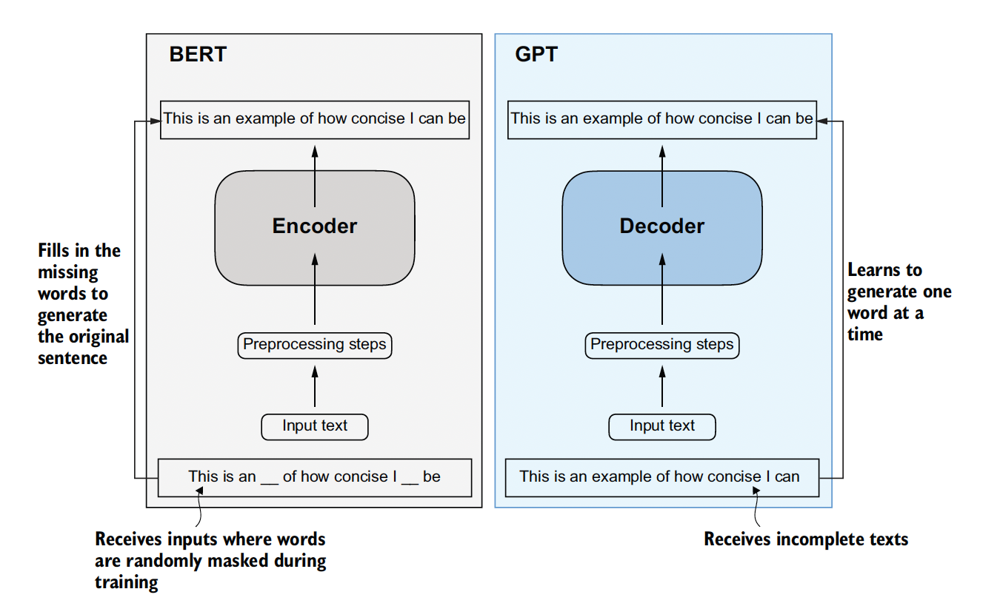
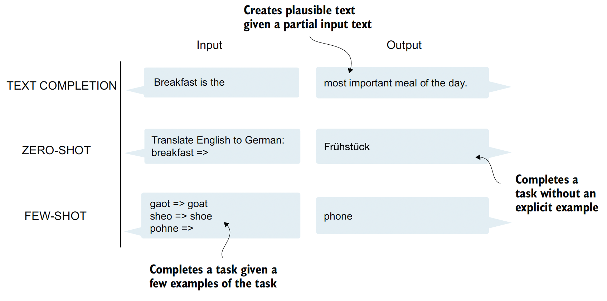

# Build a Large Language Model (From Scratch)

**Create a Virtual Environment Setup.**

`conda create --name LLM  python=3.11.11`
`conda activate LLM`

**Install ipykernel in that environment: ipykernel is the package that provides the IPython kernel for Jupyter.**
`conda install ipykernel`

**This command is used to install a Jupyter kernel for a Python environment named firstEnv.**
`python -m ipykernel install --user --name=LLM --display-name "LLM(Python 3.11)"`

**Install Libraies for LLM:**

- `pip install packages`
- `pip install torch`
- `pip install pandas`
- `pip install numpy`
- `pip install matplotlib`
- `pip install seaborn`
- `pip install tiktoken`

## Large Language Model (LLM)

This project implements a Large Language Model from scratch, providing a comprehensive understanding of transformer architecture and natural language processing.

The diagram shows the transformer's encoder and decoder submodules. On the left, the encoder segment, which exemplifies BERT-like LLMs, focuses on masked word prediction, and it is primarily used for tasks like text classification. On the right, the decoder segment showcases GPT-like LLMs, which designers build for generative tasks and which produce coherent text sequences.

GPT, on the other hand, focuses on the decoder portion of the original transformer architecture and is designed for tasks that require generating texts. This includes machine translation, text summarization, fiction writing, writing computer code, and more. The large training datasets for popular GPT- and BERT-like models represent diverse and comprehensive text corpora encompassing billions of words, which include a vast array of topics and natural and computer languages.

GPT models, primarily designed and trained to perform text completion tasks, also show remarkable versatility in their capabilities. These models are adept at executing both **zero-shot** and **few-shot** learning tasks. Zero-shot learning refers to the ability to generalize to completely unseen tasks without any prior specific examples. On the other hand, few-shot learning involves learning from a minimal number of examples the user provides as input, as shown in figure below.

In addition to text completion, GPT-like LLMs can solve various tasks based on their inputs without needing retraining, fine-tuning, or task-specific model architecture changes. Sometimes it is helpful to provide examples of the target within the input, which is known as a few-shot setting. However, GPT-like LLMs are also capable of carrying out tasks without a specific example, which is called zero-shot setting.

## LLM Model Architecture

The three main stages of coding an LLM are implementing the LLM architecture and data preparation process (stage 1), pretraining an LLM to create a foundation model (stage 2), and fine-tuning the foundation model to become a personal assistant or text classifier (stage 3).

