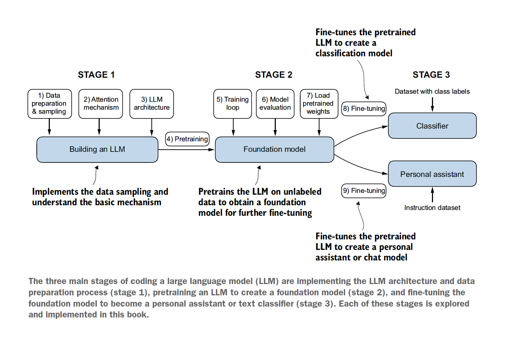

# Build a Large Language Model (From Scratch)

    This project implements a Large Language Model from scratch, providing a comprehensive understanding of transformer architecture and natural language processing.

Create a Virtual Environment and Activate the new Enviroment.
`conda create --name LLM  python=3.11.11`
`conda activate LLM`

Install ipykernel in that environment: ipykernel is the package that provides the IPython kernel for Jupyter.
`conda install ipykernel`

This command is used to install a Jupyter kernel for a Python environment named firstEnv.
`python -m ipykernel install --user --name=LLM --display-name "LLM(Python 3.11)"`

Install Libraies for LLM:

- `pip install packages`
- `pip install torch`
- `pip install pandas`
- `pip install numpy`
- `pip install matplotlib`
- `pip install seaborn`
- `pip install tiktoken`

## Large Language Model (LLM)

